# SimpleRNN Sentiment Analysis

## 🚀 **Project Overview**
**Educational implementation** of SimpleRNN for binary sentiment classification. Two datasets:
1. **Custom**: 17 patriotic Hindi/English phrases ("Bharat Mata Ki Jai!")
2. **IMDB**: 50k movie reviews (25k train/test)

**Vocab**: 17→10k | **Max Len**: 5→50 | **Final Acc**: ~80% val

## 📊 **Dataset Details**

### Custom Dataset (17 samples)
### IMDB Dataset
- **Train**: 25,000 samples × 50 tokens
- **Test**: 25,000 samples × 50 tokens
- **Vocab**: 10,000 most frequent words

## 🏗️ **Model Architecture**

```mermaid
graph LR
    A[Input: 50 tokens] --> B[Embedding: 10k→2]
    B --> C[SimpleRNN: 32 units]
    C --> D[Dense: 1 sigmoid]
    D --> E[Sentiment: 0/1]
```

## **Model Layers**
Layer (type)         Output Shape    Param #
embedding           (None, 50, 2)    20,000
simplernn           (None, 32)       1,120
dense               (None, 1)        33
Total params: 21,153

##Implementation steps
# 1. Custom Tokenizer
tokenizer = Tokenizer()
tokenizer.fit_on_texts(docs)  # 17 patriotic phrases

# 2. Sequence Processing
sequences = tokenizer.texts_to_sequences(docs)
sequences = pad_sequences(sequences, padding='post')

# 3. Model Definition
model = Sequential([
    Embedding(17, 2, input_length=5),
    SimpleRNN(32),
    Dense(1, activation='sigmoid')
])

# 4. Training
model.compile('adam', 'binary_crossentropy', metrics=['acc'])
history = model.fit(X_train, y_train, epochs=5)

##Training results
Custom Dataset:
pred.shape: (17, 2)
Sample: [[-0.0338, -0.0223], [0.0474, 0.0350]]

IMDB Dataset (5 epochs):
Epoch 1: loss=0.5801 acc=0.6731 val_acc=0.7978
Epoch 2: loss=0.3524 acc=0.8510 val_acc=0.8051 ✓
Epoch 5: loss=0.0352 acc=0.9894 val_acc=0.7670

##Quick Start
# Clone & Install
git clone https://github.com/yourusername/simplernn-sentiment.git
cd simplernn-sentiment
pip install tensorflow keras matplotlib

# Run (GPU recommended)
jupyter notebook sentiment_analysis_simplernn.ipynb

 Learning Outcomes
✅ Manual tokenization & padding
✅ Embedding layer fundamentals
✅ SimpleRNN architecture
✅ Binary classification pipeline
✅ Custom vs standard dataset
✅ GPU acceleration

🔍 Model Predictions
text
Custom: "kohli kohli" → [0.0474, 0.0350] → Positive ✓
IMDB: 25k train → 80.51% val accuracy ✓
🎓 Perfect For
NLP beginners

RNN fundamentals

Interview prep (explain tokenization→RNN)

Educational portfolios

GPU experimentation

🚀 Extensions
 LSTM/GRU comparison
 Bidirectional RNN
 Attention mechanism
 Hindi BERT fine-tuning
 Real-time inference API
